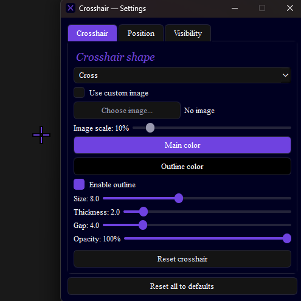

# Crosshair

A lightweight, always-on-top **crosshair overlay** for Dead by Daylight (and other games). It draws a fully customizable crosshair over your screen without ever touching the game — no files, no memory, no injection.

**Languages:** [English](#english) · [Português](#português)



---

## English

### What it is

Crosshair is a desktop overlay that renders a custom aiming reticle on top of your game. Everything is configurable through a small, dark-themed settings window.

**Features**

- Shapes: **cross**, **dot**, **X**, or your own **PNG image**
- Main color, outline color, and outline toggle
- Fine control (decimals) over size, thickness, gap and opacity
- **Show only while holding a button** (default right mouse / M2), with rebindable trigger
- **Hide from OBS / screen capture** (the crosshair stays on your screen but disappears from recordings)
- **Multi-monitor** support and free positioning (offset X/Y)
- Settings are **saved automatically** between sessions
- Clean, fixed-size UI so the layout never breaks

> **Is it safe / ban-proof?** The overlay is 100% passive: it only draws on top of the screen and reads your *own* mouse/keyboard state through the operating system. It never reads or writes the game's files or memory. Dead by Daylight explicitly allows crosshair overlays.

### Download & Use (for players)

You do **not** need Python or anything else installed — the release is self-contained.

1. Go to the [**Releases**](../../releases) page.
2. Download **`Crosshair.zip`**.
3. **Extract** the whole folder anywhere (e.g. your Desktop). Keep the files together.
4. Open the folder and run **`Crosshair.exe`**.
5. First launch may show a blue *"Windows protected your PC"* screen (because the app isn't code-signed). Click **More info → Run anyway**. This is a normal warning for unsigned apps, not a virus.

**Using it**

- The settings window lets you customize everything live.
- You can **minimize** the settings window during a match — the crosshair stays on screen.
- Press **END** to close the app completely.

### Run from source (for developers)

You need [Python 3.10+](https://www.python.org/) on Windows.

```bash
git clone https://github.com/Satheuss/Crosshair.git
cd Crosshair
python -m venv venv
venv\Scripts\activate
pip install -r requirements.txt
python main.py
```

### Build the .exe yourself

With the virtual environment active:

```bash
pip install pyinstaller
build.bat
```

`build.bat` runs `Crosshair.spec` and copies the icon (and the `fonts` folder, if present) next to the executable. The result is in **`dist/Crosshair/`**. To distribute, zip the whole `dist/Crosshair` folder.

### Fonts

The UI uses **Cormorant Garamond** (italic) for headers and **Times New Roman** for body text. Times New Roman ships with Windows. To bundle Cormorant Garamond, drop its `.ttf` files into a `fonts/` folder before building — the app loads any font placed there. Without it, headers fall back to a system serif.

### Tech

Python · [PySide6 (Qt)](https://doc.qt.io/qtforpython/) · Windows API via `ctypes` · packaged with PyInstaller.

### License

Released under the MIT License — see `LICENSE`. *(Add a `LICENSE` file if you want others to reuse it freely.)*

---

## Português

### O que é

O Crosshair é um overlay de desktop que desenha uma mira personalizada por cima do seu jogo. Tudo é configurável por uma pequena janela de configurações com tema escuro.

**Recursos**

- Formas: **cruz**, **ponto**, **X** ou uma **imagem PNG** sua
- Cor principal, cor do contorno e liga/desliga do contorno
- Controle fino (com decimais) de tamanho, grossura, espaçamento e opacidade
- **Só aparecer enquanto segura um botão** (padrão botão direito / M2), com gatilho reconfigurável
- **Sumir do OBS / captura de tela** (a mira continua na sua tela, mas some das gravações)
- Suporte a **múltiplos monitores** e posicionamento livre (deslocamento X/Y)
- Configurações **salvas automaticamente** entre as sessões
- Interface de tamanho fixo, pra o layout nunca distorcer

> **É seguro / dá ban?** O overlay é 100% passivo: ele só desenha por cima da tela e lê o estado do *seu próprio* mouse/teclado pelo sistema operacional. Ele nunca lê nem escreve nos arquivos ou na memória do jogo. O Dead by Daylight permite explicitamente overlays de mira.

### Baixar e usar (para jogadores)

Você **não** precisa de Python nem de nada instalado — a versão de release é autocontida.

1. Vá até a página de [**Releases**](../../releases).
2. Baixe o **`Crosshair.zip`**.
3. **Extraia** a pasta inteira onde quiser (ex.: sua Área de Trabalho). Mantenha os arquivos juntos.
4. Abra a pasta e execute o **`Crosshair.exe`**.
5. Na primeira vez pode aparecer a tela azul *"O Windows protegeu o seu PC"* (porque o app não é assinado digitalmente). Clique em **Mais informações → Executar assim mesmo**. É um aviso normal pra apps sem assinatura, não é vírus.

**Usando**

- A janela de configurações te deixa personalizar tudo ao vivo.
- Você pode **minimizar** a janela de configurações durante a partida — a mira continua na tela.
- Aperte **END** para fechar o app completamente.

### Rodar pelo código-fonte (para desenvolvedores)

Você precisa do [Python 3.10+](https://www.python.org/) no Windows.

```bash
git clone https://github.com/Satheuss/Crosshair.git
cd Crosshair
python -m venv venv
venv\Scripts\activate
pip install -r requirements.txt
python main.py
```

### Gerar o .exe você mesmo

Com o ambiente virtual ativado:

```bash
pip install pyinstaller
build.bat
```

O `build.bat` roda o `Crosshair.spec` e copia o ícone (e a pasta `fonts`, se existir) para o lado do executável. O resultado fica em **`dist/Crosshair/`**. Para distribuir, zipe a pasta `dist/Crosshair` inteira.

### Fontes

A interface usa **Cormorant Garamond** (itálico) nos cabeçalhos e **Times New Roman** no corpo. A Times New Roman já vem no Windows. Para embutir a Cormorant Garamond, coloque os arquivos `.ttf` dela numa pasta `fonts/` antes de gerar o build — o app carrega qualquer fonte colocada ali. Sem ela, os cabeçalhos caem num serif do sistema.

### Tecnologias

Python · [PySide6 (Qt)](https://doc.qt.io/qtforpython/) · API do Windows via `ctypes` · empacotado com PyInstaller.

### Licença

Distribuído sob a Licença MIT — veja `LICENSE`. *(Adicione um arquivo `LICENSE` se quiser que outros possam reutilizar livremente.)*
